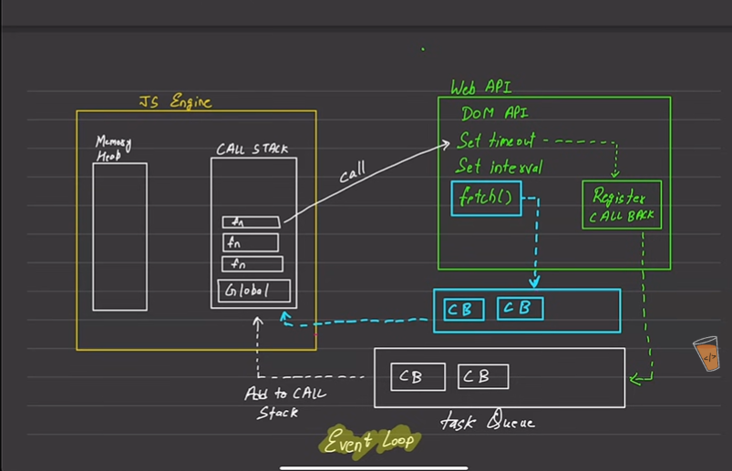
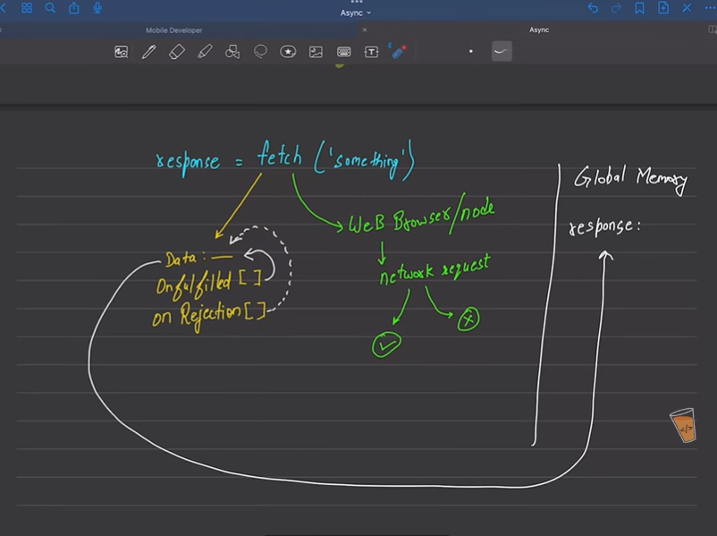

# javaScript-code
---


## API fetching
### old ways of API fetching: XLMhttpRequest

Value	State	Description
0	UNSENT	Client has been created. open() not called yet.
1	OPENED	open() has been called.
2	HEADERS_RECEIVED	send() has been called, and headers and status are available.
3	LOADING	Downloading; responseText holds partial data.
4	DONE	The operation is complete.

it is the method ---> 
```javascript
    const requestUrl = 'https://api.github.com/users/hiteshchoudhary'//api url stored in the variable
    const xhr = new XMLHttpRequest();//creating a object
    xhr.open('GET', requestUrl)//takes method and string(request url)
    xhr.onreadystatechange = function(){//this is the method use to check the change on the states
//every time the state change automatically function calling occure
        console.log(xhr.readyState);
        if (xhr.readyState === 4) {
            const data = JSON.parse(this.responseText)// be most of the time get data in the form of string
//so, we have to convert it into json format(for conversion we use this)
            console.log(typeof data);
            console.log(data.followers);
        }
    }
    xhr.send();

```
## Note:- 
to use the api fetch data we can define it variable out side the state handler and intiallized in it when the data sucessufully fetched 
state handler like **onreadyStateChange** , **onload**

---

## promise:-
in simple words , as we know that js is single threaded language and due to brower features it behaves like a asynchrous manner
so, in most of the task can't be exicuted right after the reaquest because of that we use promise to assure the completion of the task.

### promise creation --->
```javascript
const promiseOne = new Promise(function(resolve, reject){
    //Do an async task
    // DB calls, cryptography, network
    setTimeout(function(){
        console.log('Async task is compelete');
        resolve()
    }, 1000)
})

promiseOne.then(function(){
    console.log("Promise consumed");
})

```
we don't have to store the promise inside the variable
```javascript
new Promise(function(resolve, reject){
    setTimeout(function(){
        console.log("Async task 2");
        resolve()
    }, 1000)

}).then(function(){
    console.log("Async 2 resolved");
})

```
promise with 'then' , 'catch'-->
```javascript
const promiseFour = new Promise(function(resolve, reject){
    setTimeout(function(){
        let error = true//to check the error if there any
        if (!error) {
            resolve({username: "hitesh", password: "123"})//value goes to "then"
        } else {
            reject('ERROR: Something went wrong')//handle by catch()
        }
    }, 1000)
})

 promiseFour
 .then((user) => {
    console.log(user);
    return user.username
}).then((username) => {//return data by next then
    console.log(username);
}).catch(function(error){
    console.log(error);
}).finally(() => console.log("The promise is either resolved or rejected"))//it gives the final verdict 

```
handling promise by using 'async' and 'await 
```javascript
const promiseFive = new Promise(function(resolve, reject){
    setTimeout(function(){
        let error = true
        if (!error) {
            resolve({username: "javascript", password: "123"})
        } else {
            reject('ERROR: JS went wrong')
        }
    }, 1000)
});//promise creation 

async function consumePromiseFive(){//async function for handling promise responses
    try {//as we also through reject and to handle it we have to use try catch inside the function
        const response = await promiseFive
        console.log(response);
    } catch (error) {
        console.log(error);
    }
}
consumePromiseFive();//async function calling
```

full working of async await and fetching the api in real time -->
```javascript
 async function getAllUsers(){
     try {
        const response = await fetch('https://jsonplaceholder.typicode.com/users')

        const data = await response.json()
      console.log(data);
    } catch (error) {
         console.log("E: ", error);
   }
 }

getAllUsers()
```

using fetch() with then and catch(modern way of API fetching)-->
```javascript
fetch('https://api.github.com/users/hiteshchoudhary')
.then((response) => {
    return response.json()
})
.then((data) => {
    console.log(data);
})
.catch((error) => console.log(error))

```
## note-imp-> 
in case of promise  , requesting something from a api and it gives the error code 404 then it will considered as a response.

promise does not reject on http errors
it will only rejects when a network and permission issue occure


---


---
### summary-->
in javaScript , there are two types of memory :-
1-heap Memory(where all got stored variable)
2-callStack(where all un-exicuted function are stored for exicution)

and this entired arrangmenet are called as js engine
and when in any function we can call 
DOM api
setTimeout and setInterval----->there calls goes to "register call back ------->stored in the task queue(waiting for exicution)

but in case of **fetch()** method ---> special queue was created which called a priority/micro task queue--->push the task in the call stack at top even before the "task queue"

which causes the api exicution first even it written after functions
that all is to it.

---



---
### summery-->
when we use fetch() method --> it requested in to parts:
1- web browser/node.js eviornment --->network request(responce or rejection)
2- data:___(where response data going to store)
-onfulfilled[]--->for response 
-onRejection[]--->for reject
after getting into either one of them and got initiallized in data_variable--->finally response shown to the user

---
## oops concept of javaScript:


### states of promise


